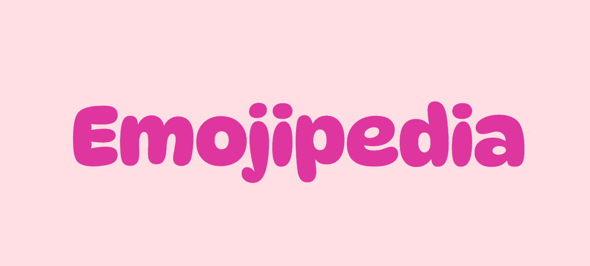
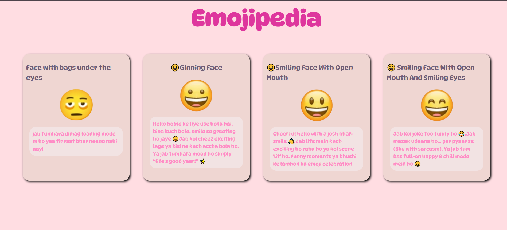

# 😄 Emojipedia – My Fun Emoji Dictionary

A colorful and expressive mini React app that showcases a variety of emojis and their *vibes* 😎 — described in a fun, casual style!

---

## 🎯 What It Does
- Displays emoji cards with a name, emoji image, and fun Hindi-style descriptions.
- Heading animates on scroll using custom React + CSS logic.
- Styled with soft, playful colors and dynamic fonts.

---

## 🚀 How to Run This Project
- Clone the repository:
   ```bash
   git clone https://github.com/your-username/emojipedia.git
   cd emojipedia
- Install dependencies:
   ```bash
   npm install
- Start the development server:
   ```bash
   npm run dev
- Open in browser:
   ```bash
   http://localhost:5173

---

## 🔧 Built With
- React.js (Vite)
- CSS3 (custom animations + layout)
- JavaScript (props, mapping, interactivity)

---

## 💡 Features
- Responsive emoji cards layout
- Scroll-based heading resize animation
- Reusable `Card` component
- Simple, clean file structure

---

## 🎨 Screenshots



---

## 🙌 Note
This was a small fun project I built just for learning and experimenting with React and CSS.  
Nothing serious — just vibes and emojis 😄✨

---

